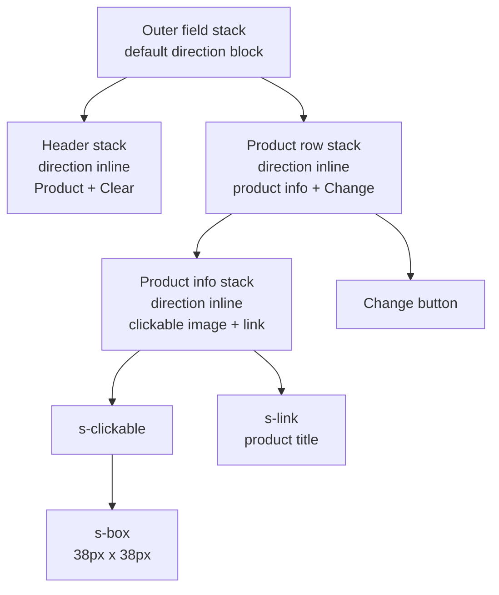
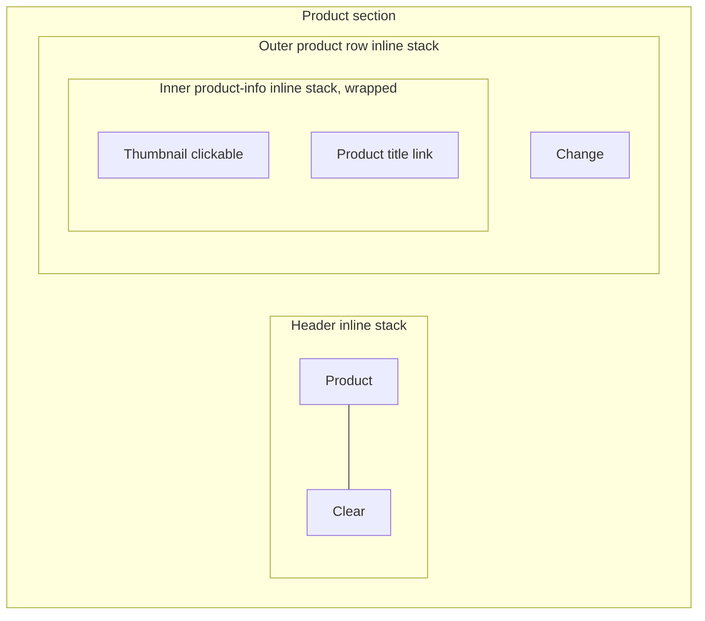
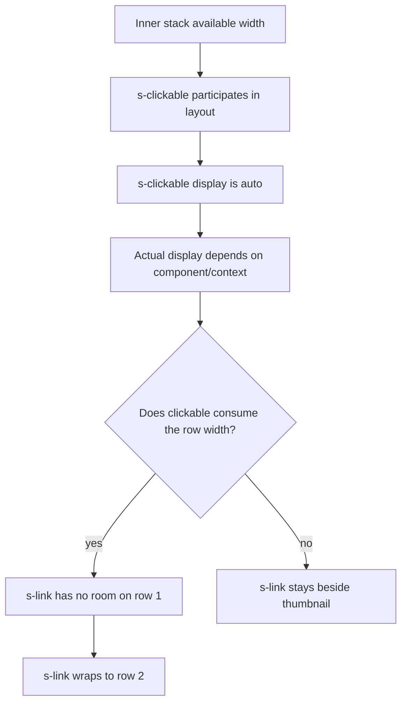
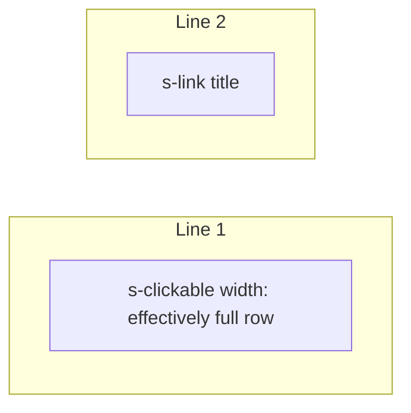
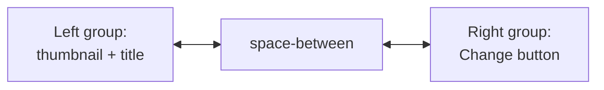

# Shopify `s-stack direction="inline"` wrapping research

## Question

Why does this stack appear vertical in the UI when every nearby stack says `direction="inline"`?

Route code: `src/routes/app.qrcodes.$handle.tsx:394-431`.

```tsx
<s-stack
  direction="inline"
  justifyContent="space-between"
  alignItems="center"
>
  <s-stack
    direction="inline"
    gap="small-100"
    alignItems="center"
  >
    <s-clickable
      href={productUrl}
      target="_blank"
      accessibilityLabel={`Go to the product page for ${selectedProduct?.title ?? "selected product"}`}
      borderRadius="base"
    >
      <s-box
        padding="small-200"
        border="base"
        borderRadius="base"
        background="subdued"
        inlineSize="38px"
        blockSize="38px"
      >
        ...
      </s-box>
    </s-clickable>
    <s-link href={productUrl} target="_blank">
      {selectedProduct?.title}
    </s-link>
  </s-stack>
  <s-button onClick={() => void selectProduct()}>
    Change
  </s-button>
</s-stack>
```

## Short answer

`direction="inline"` means “place children horizontally first”. It does not mean “never create a second row”.

Shopify `s-stack` inline stacks wrap automatically. If a child takes too much width, the next child moves to the next line. The UI then looks vertical even though the stack is still an inline stack.

In this specific markup, the suspicious child is `s-clickable`. The fixed `38px` size is applied to the inner `s-box`, not to `s-clickable` itself. If `s-clickable` lays out as a full-width/block-like item, the following `s-link` has no remaining room and wraps below it.

## Relevant Shopify docs

From `refs/shopify-docs/docs/api/app-home/polaris-web-components/layout-and-structure/stack.md:35-60`:

> `direction` ... The direction in which the stack's children are placed within the stack.

> `justifyContent` ... Controls the distribution of children along the inline axis (horizontally in horizontal writing modes).

> Use this to position items along the primary axis of the stack - horizontally for inline stacks...

From `refs/shopify-docs/docs/api/app-home/polaris-web-components/layout-and-structure/stack.md:82-84`:

> `alignContent` ... Controls the distribution of lines along the block axis when content wraps into multiple lines.

> This property only affects stacks with wrapping content.

From `refs/shopify-docs/docs/api/app-home/polaris-web-components/layout-and-structure/stack.md:735-736`:

> Understand wrapping behavior: Inline stacks wrap automatically when content doesn't fit.

From `refs/shopify-docs/docs/api/app-home/polaris-web-components/actions/clickable.md:378-389`:

> `display` ... The outer display type of the component. The outer type sets a component's participation in flow layout.

> `auto` the component's initial value. The actual value depends on the component and context.

## Mental model

An inline stack is closer to “flex row with wrapping” than “always one unbreakable row”.

```mermaid
flowchart LR
  A[direction="inline"] --> B[Lay children left to right]
  B --> C{Do children fit in the available width?}
  C -->|yes| D[One horizontal row]
  C -->|no| E[Wrap remaining children to next line]
  E --> F[Looks vertical or multi-row]
```

## What the route has

There are three different stacks involved.



The screenshot shows this arrangement:



The visual result is roughly:

```text
Product                                                   Clear

[thumbnail]                                            [Change]

Acai Raspberry
```

That does not mean the outer row stopped being inline. The `Change` button still proves the outer product row is inline: it sits to the right of the thumbnail row.

The thing that looks wrong is inside the left area: thumbnail and title are not side-by-side.

## Why the inner stack can look vertical

The inner stack has two direct children:

```mermaid
flowchart LR
  Stack[s-stack direction="inline"] --> Clickable[s-clickable]
  Stack --> Link[s-link]
```

The desired layout is:

```text
[s-clickable 38px]  [s-link title]
```

But the current code only sizes the nested box:

```tsx
<s-clickable borderRadius="base">
  <s-box inlineSize="38px" blockSize="38px">
    ...
  </s-box>
</s-clickable>
```

So the browser/component layout can behave like this:



If `s-clickable` consumes the row width, the stack is still following inline layout. It places child 1 first, then child 2. Child 2 does not fit on the same line, so child 2 wraps.



## Why `alignItems="center"` does not fix it

`alignItems` aligns children perpendicular to the stack direction.

For `direction="inline"`, that means vertical centering within each row. It does not prevent wrapping.

```mermaid
flowchart TB
  A[direction="inline"] --> B[Main axis: horizontal]
  A --> C[Cross axis: vertical]
  B --> D[Wrapping decision happens on horizontal axis]
  C --> E[alignItems affects vertical alignment inside a line]
  E --> F[Does not force link onto first line]
```

## Why `justifyContent="space-between"` can make this more confusing

The outer product row uses:

```tsx
<s-stack
  direction="inline"
  justifyContent="space-between"
  alignItems="center"
>
  <s-stack direction="inline">...</s-stack>
  <s-button>Change</s-button>
</s-stack>
```

That creates two groups:



The right button uses space too. The left group cannot simply take infinite width. If the left group contains a full-width child, the title can wrap inside the left group while the `Change` button still remains on the right.

## Most likely fix

Size the layout child, not only its descendant.

Current:

```tsx
<s-clickable borderRadius="base">
  <s-box inlineSize="38px" blockSize="38px">
```

Better:

```tsx
<s-clickable
  href={productUrl}
  target="_blank"
  accessibilityLabel={`Go to the product page for ${selectedProduct?.title ?? "selected product"}`}
  borderRadius="base"
  inlineSize="38px"
  blockSize="38px"
>
  <s-box
    padding="small-200"
    border="base"
    borderRadius="base"
    background="subdued"
    inlineSize="100%"
    blockSize="100%"
  >
```

Reason: the direct child of the inline stack is `s-clickable`. The direct child is what the stack positions. If that direct child has a known `38px` inline size, it cannot accidentally consume the whole row.

## Existing similar code in this repo

`src/routes/app.index.tsx:70-82` already sizes `s-clickable` directly:

```tsx
<s-stack direction="inline" gap="small" alignItems="center">
  <s-clickable
    href={href}
    accessibilityLabel={`Edit QR code for ${qrCode.productTitle ?? qrCode.title}`}
    border="base"
    borderRadius="base"
    overflow="hidden"
    inlineSize="20px"
    blockSize="20px"
  >
    {qrCode.productImage ? <s-image objectFit="cover" src={qrCode.productImage} /> : <s-icon size="base" type="image" />}
  </s-clickable>
  <s-link href={href}>{truncate(qrCode.title)}</s-link>
</s-stack>
```

That is the clearer pattern: size the thing that is directly inside `s-stack`.

## One-sentence rule

For `s-stack direction="inline"`, horizontal is only the starting direction; if a direct child is too wide or full-width, later children wrap below and the result can look vertical.
